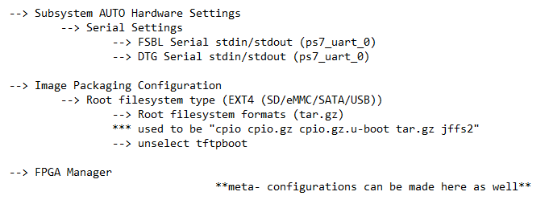

<!-- GETTING STARTED -->
# BSP Build Flow

The following outlines a step by step walkthrough for creating a board support package for a custom board. The only prerequesite is a tested base design of the board specifiying the Zynq aprt and the DRAM configuration.

### Setting up the Enviroment

Ubuntu, Xilinx, and Petalinux, versions all must be correctly installed in order for build to run successfully. Use the following table to set up virtual machine.

|  Ubuntu OS  | Xilinx Tools | Petalinux |
|:------:|:------:|:------:|
|  Bionic 18.04  | 2020.1 |  2020.1  |
|  Focal 20.04   | 2022.1 |  2022.1  |

###Building a Custom BSP (Board Suppor Packages)

All that is needed to build a bsp for your custom board is an .xsa file generated from the boards base design generated from Vivado and a configured petalinux-tools enviroment.

First, setup the linux terminal with petalinux-tools by running the following to activate the enviroment.
 ```sh
   $ source //<path to petalinux>/<version>/settings.sh
   ```
Designate a folder to hold the petalinux repo and run the following command within that folder to initiate the project.
 ```sh
   $ petalinux-create -t project -n <project_name> --template zynq
   ```
Navigate to the newly created <project_name> folder and begin the hardware configuration with the following command.
 ```sh
   $ petalinux-config --get-hw-description //<path_to_.xsa_file>
   ```
From the graphical configuration settings setup the hardware for your specific board. Example for the Red-Pitaya 125-14 can be see below.

<center></center>

From the previously created hardware configuration run the following to create the board support package.
 ```sh
   $ petalinux-package --bsp --project ./ --output <board_name>.bsp
   ```
The newly created BSP will be avaliable in the <project_name> folder.


