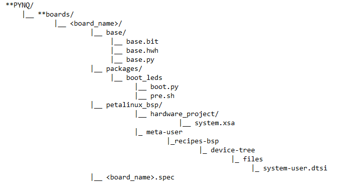
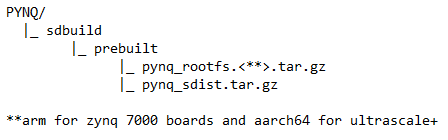

<!-- GETTING STARTED -->
## PYNQ IMAGE BUILD FLOW

The following outlines a step by step walkthrough for porting the PYNQ platform to a custom board. The only prerequisite is a tested base design of the board specifying the Zynq part type and the DRAM configuration.

### Setting up the Enviroment

Ubuntu, Xilinx, Petalinux, and PYNQ versions all must be correctly installed in order for build to run successfully. Use the following table to set up virtual machine correctly for the version of pynq to be built.

| PYNQ Version |  Ubuntu OS  | Xilinx Tools | Petalinux |
|:-----:|:------:|:------:|:------:|
| image_v2.6 |  Bionic 18.04  | 2020.1 |  2020.1  |
| imagev_2.6 |  Focal 20.04   | 2022.1 |  2022.1  |

Create a folder to hold the PYNQ repo, create a git repository in that folder, then clone the pynq github into it.
 ```sh
   $ git init
   ```
 ```sh
   $ git clone https://github.com/Xilinx/PYNQ.git
   ```
Checkout the repo branch for the version of pynq to be built. Then commit and save the changes locally.
 ```sh
   $ git checkout image_v3.0.1
   ```
 ```sh
   $ git add .
   ```
 ```sh
   $ git commit -m "initial commit"
   ```
The final step of setting up the build enviroment includes running the cloned repositories setup_host.sh script located within <repo_path>/PYNQ/sdbuild/scripts. It is important that this runs successfully for the build to complete later on. Use the following command to print a log of the scripts output and guaruntee a successful setup message prints after completion.
 ```sh
   $ source scripts/setup_host.sh | tee setup_output.txt
   ```

### Settig up the Board Repo
PYNQ can be ported to new boards via declaring a custom board file structure that describes the devices hardware, processors, and linux device tree. The following shows a base structure of what this file system should look like.

<center></center>

Some important things to note about the above file system are ...

1. NAMING! It is important the <board_name> given in the top level folder be consistent throughout the
	   project as it is constantly referenced in the makefile script. All other folder names seen above
	   should be kept relativly strict as well except for minor exceptions (packages and its subfolders).

2. the base folder should contain the base vivado build exported .bit (generated bitsream) and .hwh
	   (hardware handoff) files for the base PL design to be ran. The above example includes the instantiation
	   of the processor system aswell as a AXI_GPIO controlled connected to the boards LEDS.

3. the packages folder is where A. new board packages are included to be preinstalled on board when booted
	   or B. a base pynq python script can be placed to run at boot time. The above boot.py and pre.sh scripts
	   flash all leds in a knight rider pattern when board is successfully booted and the base PL design is 
	   flashed onto the FPGA.
4. the petalinux_bsp folder (which is used by the pynq commpiler to create a BSP (board support package) for
	   the custom board) holds the base .xsa file, which should have been exported from vivado to get the .hwh 
	   file. Although all files in the base folder are named following suit, the .xsa file should be placed in a 
	   folder named hardware_project and must be renamed to system.xsa for build to recongnize it.
	
   The petalinux_bsp folder also holds the system-user.dtsi file (drivers to be recongnized by the linux 
	   system at boot) inside the following file structure shown above. Again it is important that these files
	   and folders are precisely named for the pynq compiler to recongnize them. the recipes-bsp folder can also
	   hold patches for the ubuntu system but that is over my head to describe

5. the <board_name>.spec file describes important naming and system specifications for the makefile to 
	   refernce. The file should be written as follows with no syntactical exceptions with <board_name> being
	   replaced with the corresponding top folder board name (see above file structure)

        ARCH_<board_name> := arm
        BSP_<board_name> := 
        BITSTREAM_<board_name> := base/base.bit
        FPGA_MANAGER_<board_name> := 1
        STAGE4_PACKAGES_<board_name> := xrt pynq boot_leds ethernet

   The ARCH variable should be set to arm for Zynq-7000 series boards and aarch64 for Zynq Ultrascale+ series
	   boards. The BSP variable can be left blank as we are providing a .xsa and .dtsi to create out own for a custom
	   board. The BITSTREAM variable should be set to the path of the base bitstream as seen above. The FPGA_MANAGER
	   variable enables (1) or disables (0) fpga manager (fpgautils) to be installed the the build process and finally
	   the STAGE4_PACKAGES variable holds the desired "extra" packages to be preinstalled during the build. This
	   variable can be left blank to simplify the build process and packages such as pynq or ethernet can be installed
	   at runtime.

After the file stucture is set up and all Vivado generated designs have been included the build process can begin.


### Including Prebuilts
In order to speed up the build process (and since I have never successfully built pynq any other way) it is recommended to include a prebuilt pynq source distribution and pynq root file system for the corresponding pynq version. This drastically speeds up the build process (reduces by multiple hours) and since most boards rely on either Zynq-7000 or Zynq-Ultrascale+ chips is common practice.

Withing the PYNQ/sdbuild repo, create a new folder named prebuilt. Inside this folder copy the pynq source distribution and pynq root file system tarballs to this folder. These files for image_v3.0.0 can be found at the following links.
 ```sh
    PYNQ_SDIST = https://github.com/Xilinx/PYNQ/releases *under assets dropdown*
    PYNQ_ROOTFS = http://www.pynq.io/board.html *under PYNQ SD card image*
   ```
These files should be renamed as follows for the makefile to find them.

<center></center>


### Finally Building
The makefile depends on all xilinx tools and petalinux therefore before running those tools must be activated in the current terminal. Naviagte to your installations of vivado, vitis, and petalinux and run the corresponding settings64.sh/settings.sh scripts within each repository. (A shell script can be created to expidite this process)
 ```sh
	source //tools/Xilinx/2022.1/Vivado/2022.1/settings64.sh
	source //tools/Xilinx/2022.1/Vitis/2022.1/settings64.sh
  	source //tools/Xilinx/2022.1/Petalinux/2022.1/settings.sh
   ```
Navigate back the the PYNQ/sdbuild then open the boards folder and delete all other boards besides the desired board folder previously created then commit these changes. The compiler will try to create pynq images for all boards in this folder so this greatly reduces the build process. Finally the make command can be run from the PYNQ/sdbuild repo to initiate the build process. The makefile should correctly assume the pynq source distribution and root file system are included in a prebuilt folder but if an error occurs they can be specifically recongized using the following flags.
 ```sh
   $ make PYNQ_SDIST=//<path_to_PYNQ>/sdbuild/prebuilt/pynq_sdist.tar.gz PYNQ_ROOTFS=//<path_to_PYNQ>/sdbuild/prebuilt/pynq_rootfs.arm.tar.gz BOARDS=<board_name> BOARDDIR=//<path_to_PYNQ>/boards/<board_name>
   ```
If the build process completes all created files will be packaged into an image and stored in the sdbuild/output/ folder in the form <board_name>.iso.


## TROUBLE SHOOTING
The build process is quite fragile and more often than not errors will occur. The following outlines the most common and their work arounds / solutions.

### 1. PYNQ_DIST or PYNQ_ROOTFS files not found errors:
   
When this error occurs it is most likely becuase the location, or more importantly the naming of the prebuilt source distribution or root file system is incorrect. As referenced before the two files should be kept in their packed in their .tar types inside of PYNQ/sdbuild/prebuilt/ and labeled pynq_rootfs.<arm/aarch64>.tar.gz 	pynq_sdist.tar.gz accordingly.

### 2. Build stopping after successfully checking enviroment:

My first couple builds (with all flags assigned correctly) led to the build stopping shortly after verifying system packages (about 1 minute into the build). This happens becuase for some reason against PYNQ's documentation, the makefile searches for all board files two folders into the boards folder. Instead of correcting the numerous makefile paths the easiest workaround is too create the incorrect structure they are looking for as follows.

<center></center>

As seen above an extra folder layer is added between boards and the included board files named <board_name> again. This will resolve the early quit error and allow the build process to continue to run.

### 3. KERNEL_DEVSRC error (deep into build):

If the build process errors out half way through and produces a kernel-devsrc incomplete or something of the sorts follow the onlyworking option is the follow the workaround document attached in this folder. WORK IN PROGRESS...


